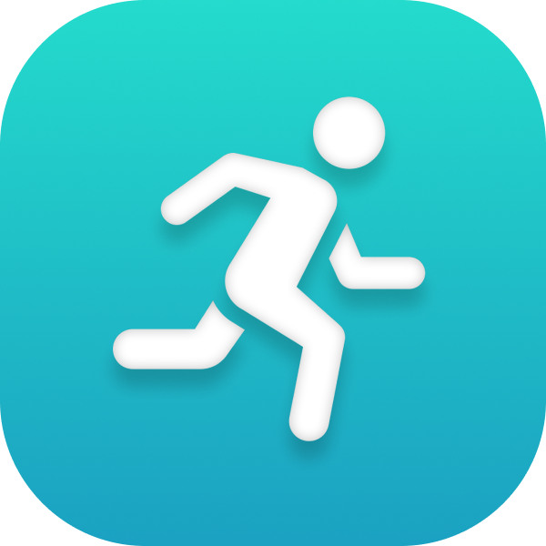

 

 <h1 align="center">Endura</h1>

---

## About

Endura is a mobile fitness app that helps both new and advanced runners achieve their goals through personally generated training plans as well as share their progress with friends. The training plans include daily running goals which include details like target pace and distance, which vary based on the athlete and their goals. Additionally, daily goals provide warm-up exercises to prepare for the run and post-run routines designed for recovery and strengthening. For users with an Apple Watch, the runs included in daily goals automatically sync to their watch to provide a custom Apple workout that will guide the user through the run. After completing the workout, the user can upload their run to share or view the analysis and map of their run themselves. Users can also connect with fellow runners, provided their friends upload their activities publicly, and engage through likes and comments to inspire each other to strive for their fitness goals. Additionally, Endura offers a range of features such as widgets, notifications, achievements, and more to enhance the user’s experience.

## Why we made it

When one of us joined the cross-country team last summer, we realized that maintaining a consistent training plan was a challenge, and understanding what makes a good training plan was even harder. To address this, we had an idea – create an app that simplifies running and helps athletes reach their fitness goals. Our solution included daily training schedules to guide runners safely towards their objectives. We also integrated warm-up and post-run routines, a part of training we learned about at school, crucial for peak performance and injury prevention. Drawing inspiration from the motivation offered by social media and other fitness apps, we incorporated social features such as likes and comments. Our ultimate goal was to make running accessible, enjoyable, and effective for everyone.

## Stats

| Tobin                                                     | Brandon                                                       |
| --------------------------------------------------------- | ------------------------------------------------------------- |
| [![wakatime][Tobin Wakatime Badge]][Tobin Wakatime Stats] | [![wakatime][Brandon Wakatime Badge]][Brandon Wakatime Stats] |
| 21,738 Lines Added                                        | 26,243 Lines Added                                            |
| 12,279 Lines Removed                                      | 17,277 Lines Removed                                          |
| 317 Commits                                               | 408 Commits                                                   |

- 15,000+ lines of code
- 150 files
- Over 600 Combined Hours

## Technical Difficulties

We really underestimated how much and how complicated the app wouCombined hourld be to make. When we started the app at the beginning of summer, we both knew nothing about Swift or SwiftUI. So, making practice apps and following tutorials through summer, we got good enough at Swift and SwiftUI that we could actually make good progress on the app itself by the end of August. Once we got working on the app, there were numerous bugs to fix and concepts we had to learn.

One key difficulty was fetching all of the raw data of the run from the Apple Watch and processing it for upload. It required a massive loop of over tens of thousands data points that needed to be averaged and condensed into readable graphs and a data type that could reasonably upload to the firebase. At first it took over 20 seconds to process and upload a short run but after many optimizations, we made it over 40x faster.

Another issue we faced was simply running out of time. Since we were learning something new from scratch, we had a slow start and essentially forgot how complicated and time consuming it would be to finish the rest of the app. Around a month before the deadline we started working on the training goals and that required an incredibly complicated data structure involving using firebase to save goals but also using core data to cache them. The goals had different types of workouts requiring enums that stored different data types and the entire app had to dynamically update based on the current goals of that week.

Also, less technical, but still a big challenge was styling the app. Learning SwiftUI was hard and since we didn’t have much experience styling with it until later in the year, we held off styling the app until later. We probably only started actually styling the app with a little over a week left in the competition. Putting in around 5 hours every day after school and even more on the final weekend we managed to somehow style the entire app and even get a few last minute features working well. That being said, we learned a lot about planning and designing a large scale app.

## Important Files

These are some files that are very important or complicated. They contain some of the most important functions and data structures that allow Endura to work.

- ### [HealthKitUtils.swift](Endura/Utils/HealthKit/HealthKitUtils.swift)

  HealthKitUtils contains all of the functions that interact with the HealthKit API. It is responsible for fetching the user's health data, such as their weight, height, and running workouts. It also contains functions thats analyze the running workouts and process them to be uploaded to firebase.

- ### [CacheUtils](Endura/Utils/)

 CacheUtils handles caching and fetching files using Core Data. This allows our app to be functional offline, without any wifi or data. This also improves the speed of the app by caching data that is used often so that data can be fetched from the firebase asynchronously.

- ### [UsersCacheModel](Endura/Utils/Users/UsersCacheModel.swift)

 UsersCacheModel contains util functions that fetch and cache the user's data. It also contains functions that fetch and cache the user's friends' data. This file is used throughout the app to access the user's data. It handles the fetching from cache and async fetching from the database. It also handles syncing the updated data with the database.

- ### [TrainingGenerationUtils](/Endura/Utils/Training/TrainingGenerationUtils.swift)

 TrainingGenerationUtils contains the functions that generate the training plans for the user. It takes in the user's fitness level, goals, and preferences and generates a training plan that will help them achieve their goals. It also contains functions that generate the daily goals for each day of the training plan.

- ### [ActiveUserModel](Endura/Utils/GlobalModels/ActiveUserModel.swift)

 ActiveUserModel is the environment object that handles the data for the active user. It contains the user's data, such as their name, email, and profile picture. It also contains the user's training plan and daily goals. This file is used throughout the app to access the user's data. It handles the fetching from cache and async fetching from the database. It also handles syncing the updated data with the database.

<!-- Variables -->

[Tobin Wakatime Badge]: https://wakatime.com/badge/user/6a864549-6180-46a1-8054-3bbf436bea8f/project/7ca6a4c3-b0ef-462d-a431-caeefce6485f.svg

[Tobin Wakatime Stats]: https://wakatime.com/badge/user/6a864549-6180-46a1-8054-3bbf436bea8f/project/7ca6a4c3-b0ef-462d-a431-caeefce6485f

[Brandon Wakatime Badge]: https://wakatime.com/badge/user/d5c163fb-076b-4106-865a-b93e97f1f252/project/59d68b84-c19d-4557-9920-fd40b57d7d82.svg

[Brandon Wakatime Stats]: https://wakatime.com/badge/user/d5c163fb-076b-4106-865a-b93e97f1f252/project/59d68b84-c19d-4557-9920-fd40b57d7d82
